# Multimodal Arbitrary Style Transfer

The official implementation of the ICASSP paper "A simple way of multimodal and arbitrary style transfer".

## Requirements

[Theano](http://deeplearning.net/software/theano/index.html)

[neuralnet](https://github.com/justanhduc/neuralnet)

## Usages

### Training
#### Dataset

Download the MS COCO 2017 train and valid sets [here](http://cocodataset.org/#download).
Put all the downloaded folders into a folder.
 
Next download the [Wikiart](https://www.kaggle.com/c/painter-by-numbers) train/test dataset.
Also put the train/test split csv files into the downloaded folder


#### Training

First, download the trained normalized VGG weight [here](https://github.com/ftokarev/tf-vgg-weights/raw/master/vgg19_weights_normalized.h5). 

We bootstrap the network from a trained AdaIN.
To train an AdaIN model in Theano, please see [here](https://github.com/justanhduc/AdaIN).
We provide a trained AdaIN weight [here](https://yonsei-my.sharepoint.com/:u:/g/personal/adnguyen_o365_yonsei_ac_kr/EQTNxXHb4h9Em2HE_OB-rggBmaAHeBD8yjYnwowTVDXpXQ?e=yoWBev).
Put all the weight files into the project root.

To train a network using the default settings, use

```
python train.py path/to/COCO-train-valid-root path/to/WikiArt
```

#### Testing

To test the network, prepare a folder of input images, a folder of style images, and a pretrained model.
A trained model can be downloaded [here](https://yonsei-my.sharepoint.com/:u:/g/personal/adnguyen_o365_yonsei_ac_kr/EVsx-iJT-zBOpUNVSvIIkDsB5qPa2DZ-_FXFF34p0z7fsQ?e=1KbUXE).
Then execute

```
python test.py path/to/input/images path/to/style/images/ path/to/a/trained/weight/file
```

By default, the script will generate 5 images/style. User ```--help``` to see more options.

## Results

<p align='center'>
  
  
  
  
  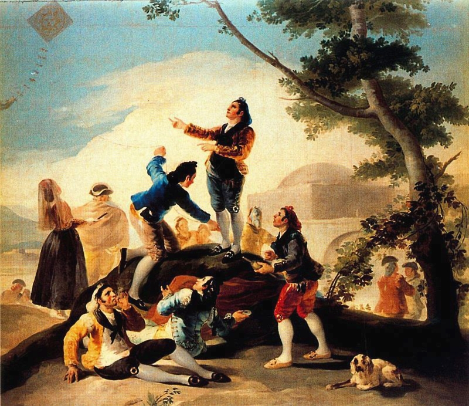
  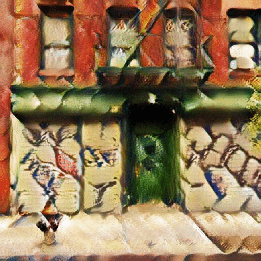
</p>

<p align='center'>
  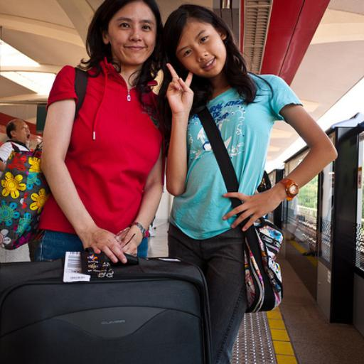
  
  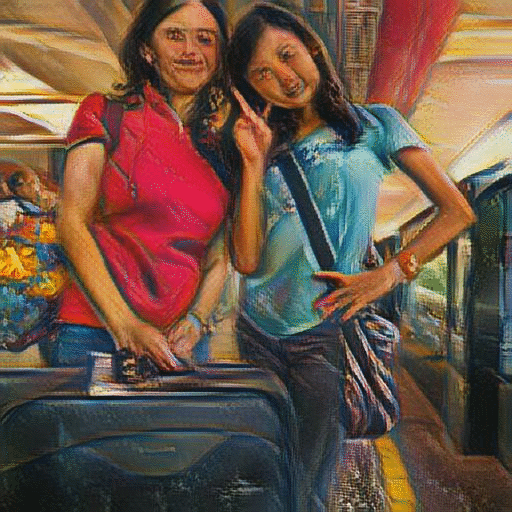
  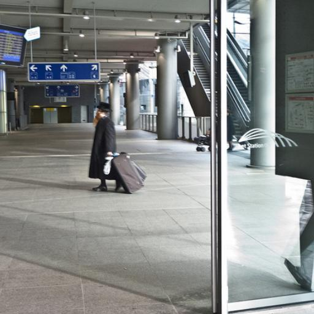
  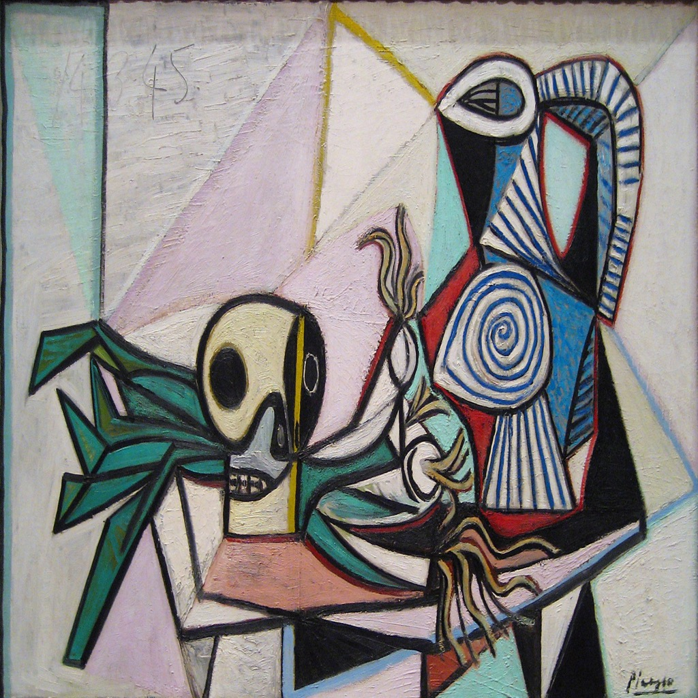
  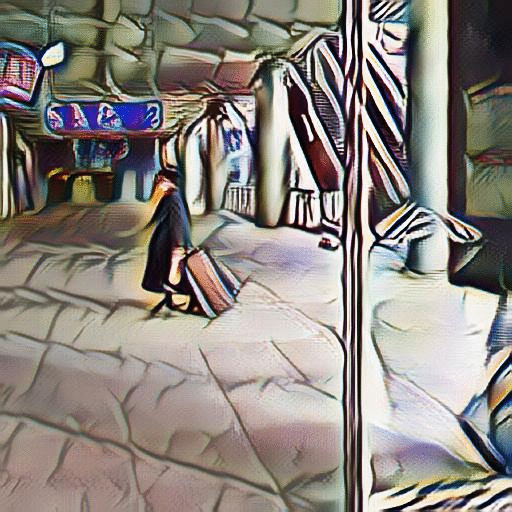
</p>

<p align='center'>
  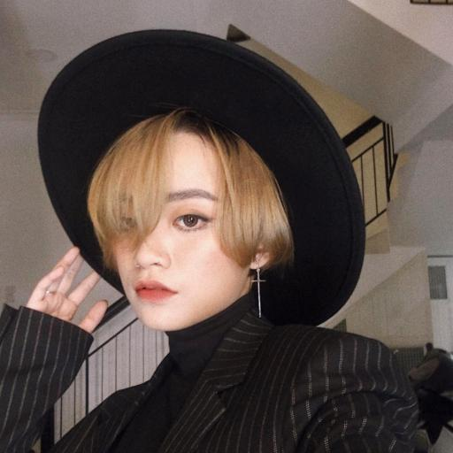
  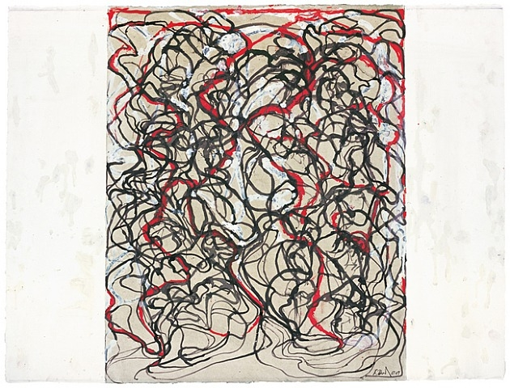
  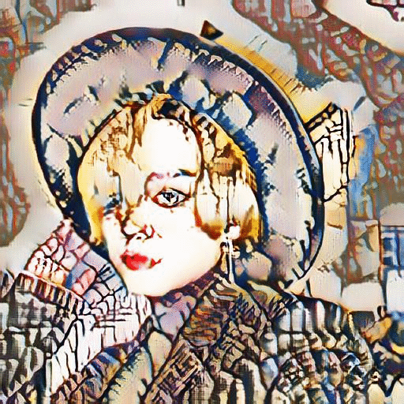
  
  
  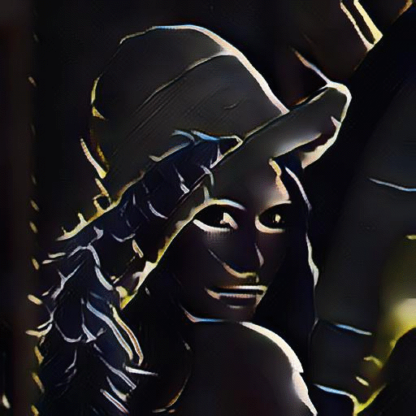
</p>

## Citation

If you use this implementation in your paper, please kindly cite the following paper

```
@inproceedings{multar,
   author = {Nguyen, Anh-Duc and Choi, Seonghwa and Kim, Woojae and Lee, Sanghoon},
   title = {A simple way of multimodal and arbitrary style transfer},
   booktitle = {2019 IEEE International Conference on Acoustics, Speech and Signal Processing (ICASSP)},
   publisher = {IEEE},
   type = {Conference Proceedings}
}
```

## References
- "Arbitrary Style Transfer in Real-time with Adaptive Instance Normalization" by Huang et al.

- For more information, checkout [my implementation of AdaIN](https://github.com/justanhduc/AdaIN).
