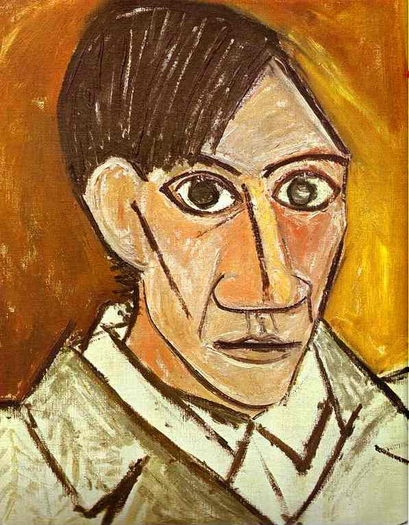
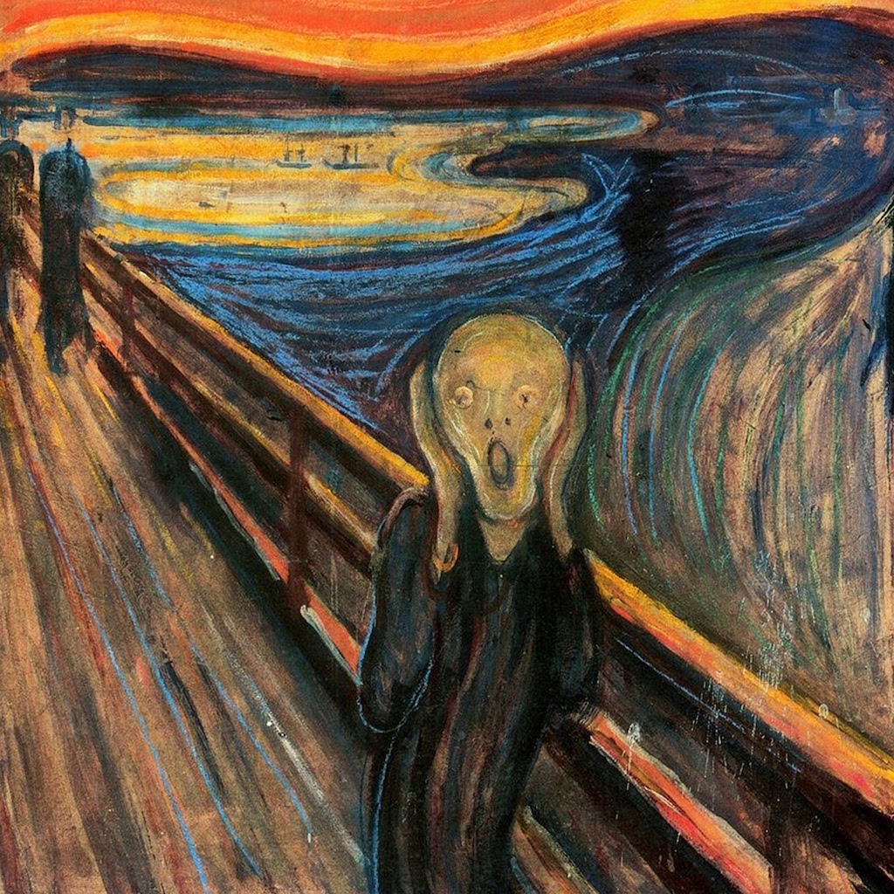
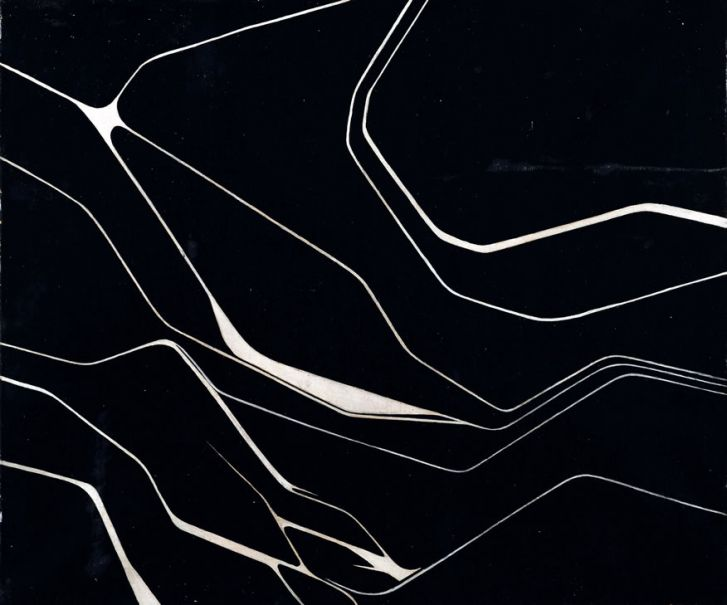

# MULTAR

Additional results for the ICASSP submissiont "A simple way of multimodal and arbitrary style transfer".

Codes will be available shortly!

# Results

  
  
  
  
  
  

  
  
  
  
  
  

  
  
  
  
  
  

## References
- "Arbitrary Style Transfer in Real-time with Adaptive Instance Normalization" by Huang et al.

- For more information, checkout [my implementation of AdaIN](https://github.com/justanhduc/AdaIN).
